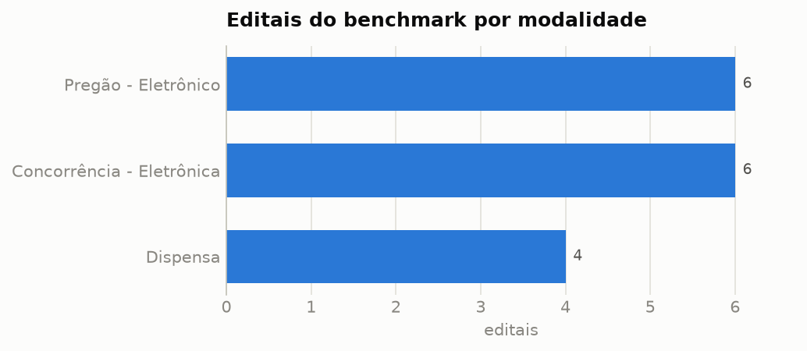

# Agente Autônomo para Análise de Editais de Licitação

Agente baseado em **RAG (Retrieval-Augmented Generation)** que extrai campos críticos de
editais de licitação do governo brasileiro (PNCP/Compras.gov.br) com **rastreabilidade de
evidências**, avaliado com métricas **RAGAS** (Faithfulness e Answer Correctness) contra o
próprio texto do edital e comparado a um **baseline de regex**.

> Projeto da disciplina de Projetos de IA. Proposta completa em `docs/` (seções citadas ao
> longo deste README).

---

## 1. Problema e pergunta de pesquisa

Empresas que participam de compras públicas precisam analisar editais extensos (dezenas a
centenas de páginas) nos quais prazos, valores e exigências aparecem de forma fragmentada e
não padronizada. A análise manual é lenta e propensa a erros; busca textual não oferece
extração estruturada com evidência auditável.

**Pergunta de pesquisa** — Em que medida um agente autônomo baseado em RAG consegue extrair
campos críticos (prazo, valor estimado, modalidade) de editais de licitação com
**Faithfulness ≥ 0,85** e **Answer Correctness ≥ 0,80** (RAGAS), utilizando o próprio texto
do edital como referência, com **taxa de alucinação ≤ 10%**?

**Hipótese** — O agente atinge os três limiares nos campos críticos.

**Baseline comparativo** — extração por regex sobre o texto integral, com meta de
referência de 80% de acurácia nos campos críticos.

## 2. Dados

| Item | Descrição |
|---|---|
| Fonte | PNCP — APIs públicas de consulta e de documentos (sem autenticação) |
| Licença | Dados públicos e abertos (Lei 12.527/2011); sem PII |
| Amostra piloto | **16 editais** (janela 01–15/06/2026), 3 modalidades, **8 UFs** |
| Formato | JSON (metadados oficiais) + PDF/DOCX (edital e anexos) |
| Ground truth | Metadados oficiais da contratação no PNCP (`dataEncerramentoProposta`, `valorTotalEstimado`, `modalidadeNome`, `objetoCompra`, órgão, UF, critério de julgamento dos itens) |
| Rastreabilidade | SHA256 de cada documento em [`data/data_card.md`](data/data_card.md) e `data/benchmark/documentos.json` |

Características da amostra (EDA completa em `relatorio/resultados/eda.json` e
`relatorio/figuras/`): documentos de **1 a 220 páginas** (mediana 35), 535 a 383 mil
caracteres, **8.333 chunks** indexados; 2 casos de orçamento sigiloso/ausente (tratados
como indisponibilidade, não como erro do modelo — seção 2.4 da proposta); 1 edital
publicado como DOCX; PDFs com páginas escaneadas identificadas para OCR.



**Nuance importante do benchmark**: alguns órgãos publicam no PNCP apenas documentos
resumidos (ex.: relação de itens de 1 página). O pipeline anota, por campo, se o valor
oficial é verificável no texto baixado (`gt_presente_no_texto` em
`data/benchmark/benchmark.json`) — p.ex. o prazo consta em 57% dos textos e o valor em 43%.
As métricas são reportadas nas duas visões: sobre **todos** os campos e sobre os campos
**disponíveis no texto**.

## 3. Arquitetura

```
            PNCP (APIs públicas)
                    │  01_coletar.py  ── metadados oficiais → ground truth (benchmark.json)
                    ▼
        data/raw/*.bin (PDF/DOCX/ZIP, SHA256)
                    │  02_processar.py ── pypdf + fallback OCR (Tesseract) + DOCX
                    ▼
        data/processed/*.txt
                    │  03_indexar.py ── chunking semântico (seções, overlap)
                    ▼                    + embeddings multilíngues (fastembed/ONNX)
        data/indices/<edital>/ (FAISS, 1 índice por edital)
                    │
                    ▼
   ┌─────────────────────────────────────┐      ┌──────────────────────────┐
   │ AGENTE (single-agent, tool use)     │      │ BASELINE (regex sobre o  │
   │  buscar_trechos / ler_trecho /      │      │ texto integral)          │
   │  registrar_extracao (schema strict) │      └──────────────────────────┘
   │  LLM: Anthropic claude-opus-4-8     │
   └─────────────────────────────────────┘
                    │  04_extrair.py
                    ▼
        extração estruturada com evidências (chunk_id + citação + confiança)
                    │  05_avaliar.py
                    ▼
        RAGAS (Faithfulness, Answer Correctness) + taxa de alucinação
        + acurácia por campo + custo/latência + IC bootstrap 95%
```

**Controle de alucinação** (dupla camada):
1. o prompt obriga cada campo a citar `chunk_id` + trecho literal; o pós-processamento
   valida a citação contra os chunks efetivamente recuperados (`evidencia_valida`);
2. o Faithfulness decompõe a extração em afirmações atômicas verificadas por um juiz
   contra os contextos; a taxa de alucinação é o complemento (campos preenchidos sem
   sustentação nos trechos recuperados).

## 4. Metodologia

- **Chunking semântico** (`indexacao/chunking.py`): segmentação por seções típicas de
  edital ("1. DO OBJETO", "CLÁUSULA…", "ANEXO…"), janela ~1400 caracteres com overlap de
  250 e título da seção como metadado (rastreabilidade). Parâmetros em
  `configs/config.yaml`.
- **Indexação vetorial** (`indexacao/vetorial.py`): FAISS `IndexFlatIP` com vetores
  normalizados (cosseno); embeddings `paraphrase-multilingual-MiniLM-L12-v2` via
  fastembed (ONNX/CPU — sem GPU e sem torch).
- **Agente** (`agente/agente.py`): loop agêntico manual (Messages API da Anthropic com
  tool use) com 3 ferramentas — busca semântica, leitura de chunk com vizinhos e entrega
  final com **JSON Schema estrito**. Modelo padrão `claude-opus-4-8` (configurável).
- **Baseline** (`baseline/regex_extractor.py`): âncoras + regex por campo sobre o texto
  integral (abordagem clássica baseada em regras).
- **Métricas RAGAS** (`avaliacao/ragas_metrics.py`): implementação própria e reprodutível
  das definições de Es et al. (2023, arXiv:2309.15217) — Faithfulness = proporção de
  afirmações da resposta sustentadas pelos contextos (juiz LLM na avaliação real; juiz
  heurístico determinístico para CI/offline); Answer Correctness = 0,75·F1 factual +
  0,25·similaridade semântica de embeddings (pesos padrão do RAGAS). A biblioteca `ragas`
  não foi usada para permitir juiz Anthropic + execução offline com as mesmas definições.
- **Custo e latência** (objetivo 6): tokens de entrada/saída, nº de chamadas, custo
  estimado (US$) e latência por edital registrados em cada execução.
- **Agregação**: média ± desvio-padrão e **IC 95% por bootstrap percentil** (2.000
  reamostragens sobre editais); benchmark incremental (16 editais no piloto, expansível
  a 20 conforme estabilização do desvio-padrão — objetivo 2).

## 5. Resultados

### 5.1 Baseline regex (n=16 editais reais)

| Métrica | Todos os campos críticos | Só campos disponíveis no texto |
|---|---|---|
| Acurácia campos críticos | **55,2%** ± 19,0 (IC95 46,9–64,6%) | **83,3%** ± 29,8 (IC95 68,8–95,8%) |
| Latência por edital | 0,03 s | — |

Acurácia por campo (todos): modalidade **100%**, UF 87,5%, critério de julgamento 81,3%,
órgão 68,8%, objeto 50%, **prazo de entrega 28,6%**, **valor estimado 28,6%**.

**Análise de erros do baseline**: o perfil confirma a limitação conhecida de sistemas por
regras — campos categóricos com vocabulário fechado (modalidade, critério) são fáceis;
campos numéricos/datas, redigidos com alta variabilidade ("até às 08h31 do dia 06/07/2026",
tabelas, anexos), concentram os erros. É exatamente a lacuna que o agente RAG ataca.

### 5.2 Smoke test offline (MockLLM + juiz heurístico)

Pipeline completo (agente → ferramentas → RAGAS → bootstrap) validado de ponta a ponta sem
chave de API: `make smoke`. Números do mock **não** representam o agente real (o mock usa
as heurísticas do baseline sobre os trechos recuperados): faithfulness 0,91, taxa de
alucinação 0,09, answer correctness 0,52 — servem como referência de "RAG-retrieval +
regras" e para testar a instrumentação.

### 5.3 Agente RAG real (requer `ANTHROPIC_API_KEY`)

```bash
export ANTHROPIC_API_KEY=sk-ant-...
make agente          # extração com claude-opus-4-8 (ou MODELO=claude-haiku-4-5 make agente)
make avaliar         # RAGAS com juiz LLM + custo/latência por edital
```

A avaliação imprime e salva (`relatorio/resultados/avaliacao_agente.json`) o comparativo
com as metas da pergunta de pesquisa:

| Métrica | Meta | Onde ver |
|---|---|---|
| Faithfulness | ≥ 0,85 | `avaliacao_agente.json → resumo.faithfulness` |
| Answer Correctness (críticos) | ≥ 0,80 | `resumo.answer_correctness` (+ variante `_disponivel`) |
| Taxa de alucinação | ≤ 0,10 | `resumo.taxa_alucinacao` |
| Custo/latência por edital | reportar | `por_edital[].uso` e `latencia_s` |

## 6. Interface web (Streamlit)

```bash
make app          # http://localhost:8501
```

A interface expõe todas as capacidades do projeto em sete páginas:

| Página | O que faz |
|---|---|
| **Visão geral** | Métricas frente às metas da pergunta de pesquisa, composição da amostra, EDA e fração do ground truth verificável no texto |
| **Editais** | Tabela do benchmark (exportável) e detalhe por edital: metadados oficiais, documento (SHA256, método de extração, avisos de OCR), texto com busca e navegador de chunks/seções |
| **Busca semântica** | Playground da ferramenta `buscar_trechos` do agente: consulta livre ou preset, top-k ajustável, scores de similaridade e expansão de contexto (`ler_trecho`) |
| **Extração** | Roda baseline ou agente (MockLLM/LLM real) ao vivo; mostra os 8 campos com confiança, **evidência citada com destaque no chunk de origem**, validação da citação, acerto vs. ground truth, custo/tokens/latência e trace das ferramentas |
| **Avaliação RAGAS** | Faithfulness, Answer Correctness, taxa de alucinação e citações válidas com IC 95%; acurácia por campo comparando agente × baseline; tabela por edital e custo total |
| **Analisar novo edital** | Pipeline sob demanda para um edital **fora do benchmark**: upload (PDF/DOCX/ZIP) ou download direto do PNCP pelo número de controle → extração → indexação → agente, com evidências |
| **Sobre** | Pergunta de pesquisa, arquitetura, controle de alucinação, ética/licença e estado do ambiente |

A chave da Anthropic pode ser informada na barra lateral (usada apenas na sessão, nunca
gravada); sem ela, o modo **MockLLM** mantém tudo navegável offline. Gráficos são
interativos (Altair) e a paleta tem passos próprios para tema claro e escuro.

## 7. Reprodutibilidade

Requisitos: Python ≥ 3.11 (testado em 3.12), ~2 GB de disco (modelo de embeddings) e,
opcionalmente, `tesseract-ocr` + `tesseract-ocr-por` + `poppler-utils` para OCR de PDFs
escaneados.

```bash
make setup              # venv + dependências fixadas (requirements.txt)
make test               # 29+ testes unitários, 100% offline
make pipeline-offline   # coleta PNCP → processa → indexa → baseline → avalia → EDA → data card
make smoke              # smoke test do agente + avaliação (mock, sem chave)
make tudo               # pipeline completo com o agente real (requer ANTHROPIC_API_KEY)
```

- **Dependências fixadas** (`requirements.txt`/`pyproject.toml`); ambiente isolado via venv.
- **Determinismo**: chunking/regex/juiz heurístico determinísticos; bootstrap com semente
  fixa (42); coleta é snapshot com SHA256 registrado (a janela de datas em
  `configs/config.yaml` congela a amostra).
- **CI** (GitHub Actions): instala dependências fixadas e roda a suíte offline a cada push.
- Textos processados e ground truth **versionados** (`data/processed/`, `data/benchmark/`)
  — os passos com LLM são reproduzíveis sem repetir a coleta.

### Estrutura do repositório

```
configs/config.yaml        # parâmetros (janela de coleta, chunking, modelo, metas)
data/benchmark/            # ground truth + hashes (versionado)
data/processed/            # textos extraídos (versionado)
data/raw/, data/indices/   # PDFs e índices FAISS (reproduzíveis; fora do git)
docs/                      # proposta e especificação da disciplina
relatorio/                 # relatório, figuras e resultados de avaliação
scripts/01..05, eda, data_card
src/edital_agent/
  coleta/pncp.py           # cliente das APIs públicas do PNCP
  extracao/pdf.py          # pypdf + OCR fallback + DOCX + ZIP
  indexacao/{chunking,vetorial}.py
  llm/cliente.py           # Anthropic + MockLLM + contabilização de custo
  agente/{agente,schema}.py
  baseline/regex_extractor.py
  avaliacao/{ragas_metrics,juiz,avaliar}.py
tests/                     # suíte offline (embedder fake, LLM mock)
```

## 8. Ética, licença e limitações

- Dados públicos oficiais (Lei 12.527/2011), sem PII; uso acadêmico. Código sob MIT.
- O sistema é **apoio à triagem** — não substitui análise jurídica.
- Limitações do piloto: n=16 numa janela de 2 semanas; documentos resumidos publicados por
  alguns órgãos limitam o teto de extração (medido e reportado via
  `gt_presente_no_texto`); OCR depende de binários externos; anexos além de 150 páginas
  são truncados no piloto (`max_paginas_pdf`).

## 9. Referências

- Es, S. et al. **RAGAS: Automated Evaluation of Retrieval Augmented Generation**. 2023.
  arXiv:2309.15217.
- Lewis, P. et al. **Retrieval-Augmented Generation for Knowledge-Intensive NLP Tasks**.
  NeurIPS 2020.
- BRASIL. **Lei nº 14.133/2021** (Licitações e Contratos) e **Lei nº 12.527/2011** (LAI).
- PNCP — Manual das APIs de consulta: https://pncp.gov.br/
