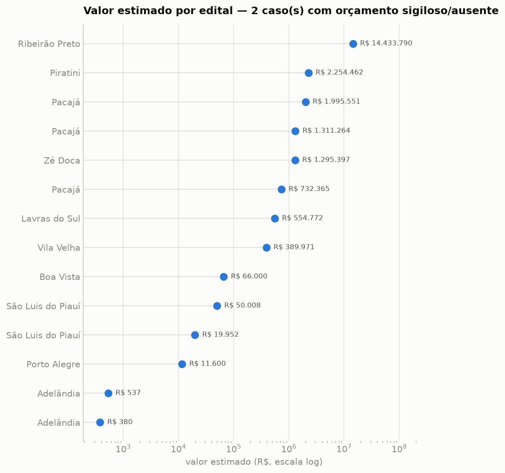
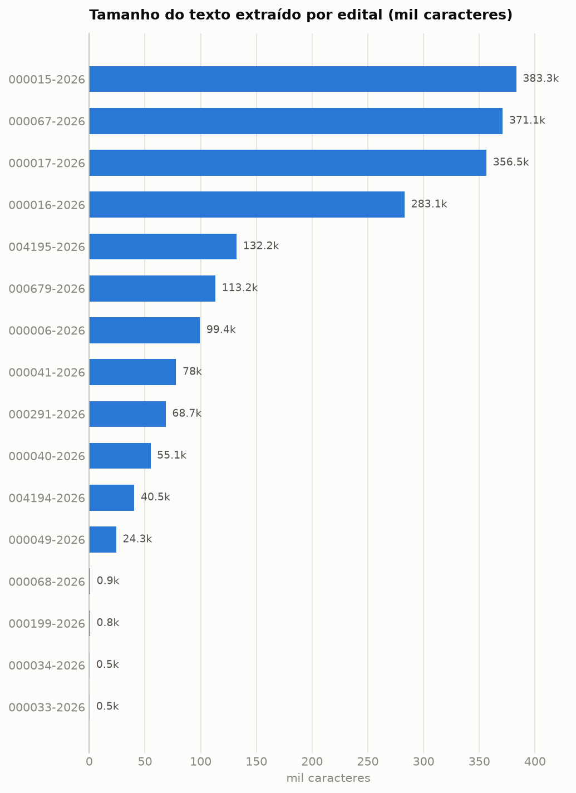

# Relatório — Agente Autônomo para Análise de Editais de Licitação

Relatório técnico do benchmark piloto. Complementa o `README.md` com a análise
exploratória, decisões de pré-processamento (seção 2.5 da proposta) e a análise de
resultados/erros.

## 1. Coleta e composição do benchmark

Amostra coletada das APIs públicas do PNCP em 09/07/2026 (publicações de 01–15/06/2026),
com cotas por modalidade (máx. 6) e por UF (máx. 3) para mitigar homogeneidade:

- **16 contratações**: 6 Pregão Eletrônico, 6 Concorrência Eletrônica, 4 Dispensa;
- **8 UFs** (RS, SP, PA, GO, PI, MA, ES, RR), esferas municipal e estadual;
- valores oficiais de R$ 380 a R$ 14,4 milhões (2 casos sigilosos/ausentes);
- ground truth = metadados oficiais da contratação (fonte primária do governo), com
  SHA256 de cada documento no [data card](../data/data_card.md).

## 2. EDA e achados do pré-processamento

| Estatística | Valor |
|---|---|
| Páginas por documento | mediana 35, média 60,7, máx. 220 |
| Caracteres extraídos | mediana 73,4 mil; mín. 535; máx. 383 mil |
| Métodos de extração | 15 pypdf, 1 DOCX |
| Chunks indexados | 8.333 (média 521/edital) |

Achados que orientaram o pipeline (respondem ao TODO da seção 2.5 da proposta):

1. **Formatos heterogêneos**: um órgão publicou o edital como DOCX; outros, como ZIP com
   anexos — o extrator resolve PDF, DOCX e ZIP (escolhendo o arquivo do edital).
2. **PDFs escaneados**: 2 editais de São Paulo têm 1–26 páginas de imagem; o pipeline
   detecta páginas de baixa densidade textual e aciona OCR quando o Tesseract está
   instalado (avisos registrados em `data/processed/extracao_meta.json`).
3. **Documentos resumidos**: municípios pequenos publicam avisos de dispensa de 1 página
   e há caso de concorrência cujo único documento no PNCP é a relação de itens. Por isso
   o benchmark anota, por campo, se o valor oficial é verificável no texto
   (`gt_presente_no_texto`): prazo 57%, valor 43%, modalidade 94%, objeto 100%.
4. **Chunking**: janela de 1.400 caracteres com overlap de 250, segmentada por cabeçalhos
   de seção (numeração, CLÁUSULA, ANEXO), preservando o título da seção como metadado —
   evita cortar datas/valores na fronteira e dá rastreabilidade à citação.
5. **Portas não padrão nas URLs de download**: o campo `url` da API embute portas altas
   que estouram timeout; o coletor reconstrói a URL canônica na porta 443.

## 3. Resultados

### 3.1 Baseline regex (execução real, n=16)

| Campo | Acurácia | n avaliados |
|---|---|---|
| modalidade | 100% | 16 |
| uf | 87,5% | 16 |
| criterio_julgamento | 81,3% | 16 |
| orgao_responsavel | 68,8% | 16 |
| objeto | 50,0% | 16 |
| prazo_entrega_proposta | 28,6% | 14 |
| valor_estimado | 28,6% | 14 |

- Campos críticos (prazo, valor, modalidade): **55,2%** (IC95 46,9–64,6%) — abaixo da meta
  de 80% do baseline da proposta.
- Restrito a campos disponíveis no texto: **83,3%** (IC95 68,8–95,8%).
- Latência: 0,03 s/edital; custo zero.

**Análise de erros.** Regex resolve vocabulário fechado (modalidade 100%), mas falha na
variabilidade linguística dos campos críticos: datas de encerramento expressas em tabelas
("Data da sessão: … Horário…"), valores diluídos em anexos ou apenas em planilhas, e
avisos que remetem ao sistema de origem. Metade dos erros de prazo/valor ocorre em
documentos onde a informação nem consta no texto baixado — teto de qualquer extrator
(por isso a visão "disponíveis no texto").

### 3.2 Verificação do pipeline agêntico (smoke test offline)

`make smoke` executa o agente com `MockLLM` (busca semântica real + heurísticas do
baseline sobre os trechos recuperados) e avalia com juiz heurístico: faithfulness 0,91,
alucinação 0,09, answer correctness 0,52 (n=16). Os números validam a instrumentação
(loop de ferramentas, rastreio de contextos, métricas, IC bootstrap) e servem de
referência "RAG-retrieval + regras"; **não** medem o agente com LLM.

### 3.3 Agente RAG com LLM (avaliação real)

Requer `ANTHROPIC_API_KEY`; executar `make agente && make avaliar`. A avaliação produz
`relatorio/resultados/avaliacao_agente.json` com Faithfulness, Answer Correctness, taxa
de alucinação (metas: ≥0,85 / ≥0,80 / ≤0,10), acurácia por campo, proporção de citações
válidas e custo/latência por edital, com IC bootstrap 95% — base para o veredito da
pergunta de pesquisa. O ambiente desta execução não dispunha de chave da API; o repositório
deixa o passo pronto e determinístico (mesmos índices e benchmark versionados).

## 4. Discussão e limitações

- **Confronto com a hipótese**: pendente da execução com LLM (seção 3.3). O baseline já
  demonstra a lacuna que motiva a hipótese: 28,6% em prazo/valor.
- **Validade do ground truth**: metadados oficiais são fonte primária, mas nem sempre
  constam no documento publicado; o benchmark mede e reporta essa disponibilidade em vez
  de ignorá-la (evita penalizar o extrator por informação inexistente no texto).
- **Amostra piloto**: n=16 numa janela de 2 semanas; desvios-padrão por edital ainda
  altos (0,19–0,39) — o protocolo incremental prevê expansão a 20 editais e novas UFs.
- **OCR**: sem os binários do Tesseract instalados, páginas escaneadas ficam vazias
  (impacto medido: 2 editais parcialmente afetados).

## 5. Reprodutibilidade

Ver README §6 (`make setup && make pipeline-offline && make smoke`; CI executa a suíte
offline). Artefatos versionados: ground truth, textos processados, resultados de
avaliação, figuras e data card com SHA256.
